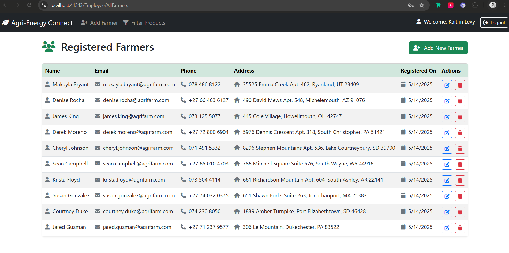
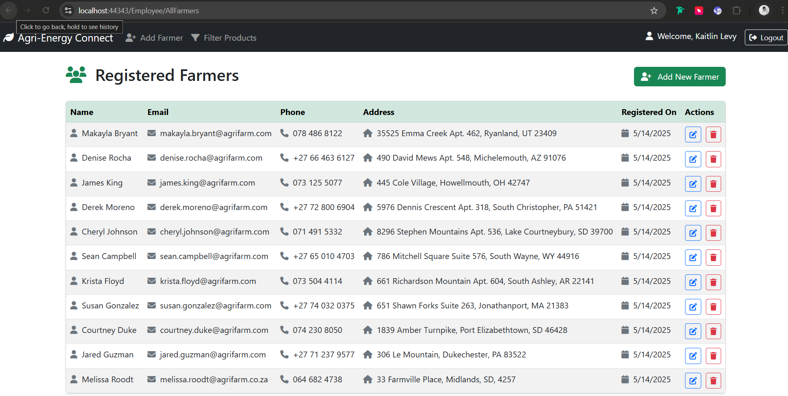
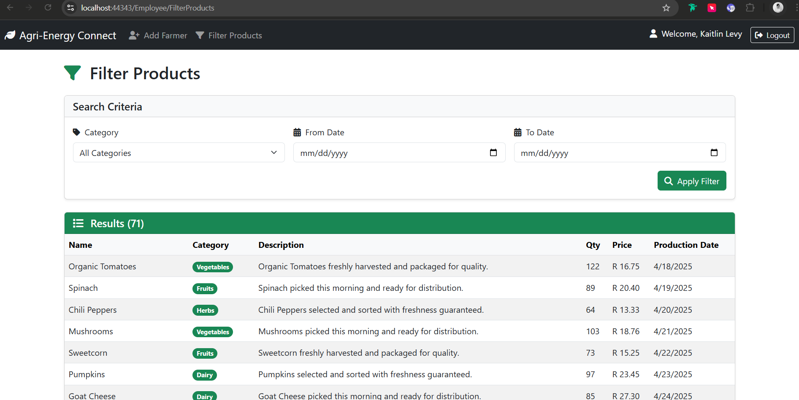
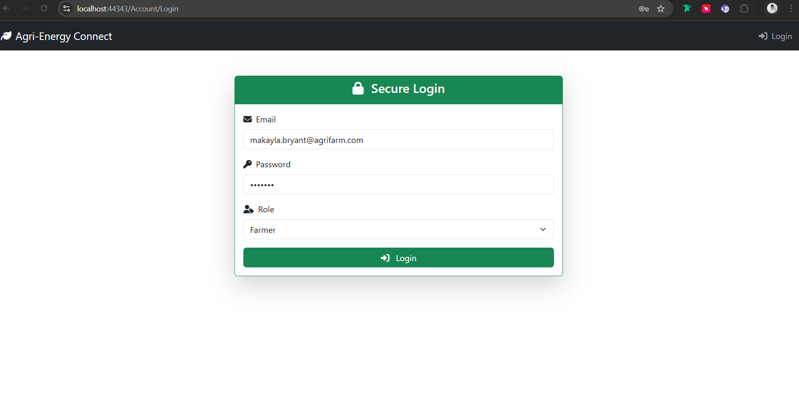
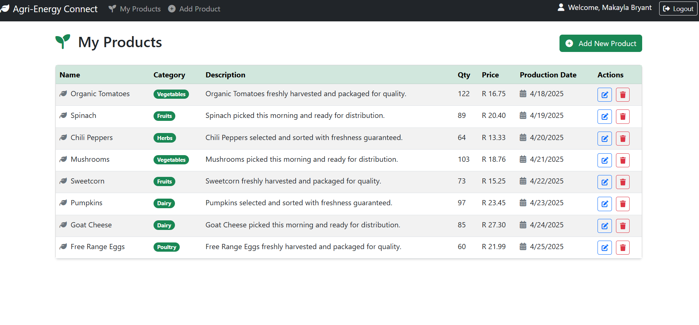
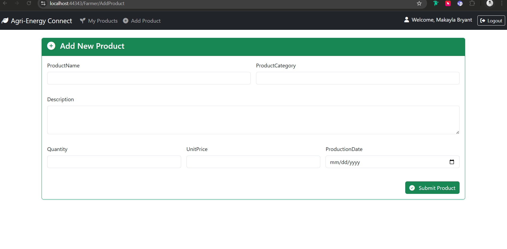

# Agri-Energy Connect – Prototype Web Application

## 🌱 Overview

Agri-Energy Connect is a prototype web platform that bridges the agricultural sector and green energy technology providers. It allows two user roles:

- **Farmers** – who can register and manage product listings  
- **Employees** – who can register farmers and filter/view products  

This ASP.NET Core MVC application demonstrates user authentication, CRUD operations, role-based access, and responsive Razor views.

---

## 🗂 Project Structure

- `Controllers/` – Contains Account, Farmer, Employee, and Home controllers.  
- `Models/` – Defines data models for Farmer, Employee, Product, and view models.  
- `Repository/` – Implements Dapper-based data access for each entity.  
- `Views/` – Razor views for both roles with Bootstrap styling.  
- `wwwroot/` – Static assets like custom styles and JS.  
- `Scripts/init.sql` – SQL file to create and populate the database.  

---

### 🗝️ Key Features

- 🔐 **Password Hashing:** All passwords are hashed using SHA-256 before being stored in the database. Plaintext passwords are never stored.  
- 🧑‍💼 **Claims-based Identity:** Users are authenticated using `ClaimsIdentity`, where roles (Farmer or Employee) are embedded into claims for access control.  
- 🧭 **Role-Based Access:** Role restrictions are enforced at controller level using the `[Authorize(Roles = "...")]` attribute.  
- 🛡 **Session Protection:** ASP.NET’s cookie authentication scheme is used to manage secure sessions.  
- ⚠️ **Login Errors:** Invalid credentials return a user-friendly error message without exposing system internals.  

---

### 🔒 Security and Authentication

The Agri-Energy Connect application includes role-based authentication using ASP.NET Core Identity principles, implemented with cookie-based authentication.

- Uses `ClaimsPrincipal` to assign user identity and role.  
- Passwords are hashed using SHA-256 (via `System.Security.Cryptography`).  
- Each user’s role is enforced at controller level using attributes.  
- Sessions are securely managed with ASP.NET Core’s built-in cookie authentication.  
- Failed login attempts do not disclose specific information to users.  

---

## 🧠 Functionality Overview
### 👥 User Roles
#### 🧑‍💼 Employee
- Logs into the secure admin interface
- Registers new farmers with validated details
- Views a complete list of all registered farmers
- Can edit or delete any farmer profile
- Filters products by category and/or production date

#### 👨‍🌾 Farmer
- Logs into a personalized dashboard
- Adds new products with complete metadata
- Views all of their own products
- Cannot view or modify any other farmer's data

### 📦 Product Management
Each product includes:

- ProductName
- ProductCategory
- Description
- Quantity
- UnitPrice
- ProductionDate

Farmers can only access and manage their own product listings.

Employees can see all products and apply filters to help with trend analysis and decision-making.

### 💡 Technologies Used
- ASP.NET Core MVC (.NET 8)
- Razor Views with Bootstrap 5
- SQL Server
- Dapper ORM
- SHA-256 for password hashing
- Cookie Authentication and ClaimsPrincipal
- Role-based Authorization

## 🛠 Setup Instructions

### ✅ Prerequisites

- Microsoft SQL Server (local or remote)  
- SQL Server Management Studio (SSMS)  
- .NET 8+ SDK  
- Visual Studio 2022+ or Visual Studio Code  

### ⚙️ Steps to Set Up

1. **Run the SQL Script**  
   Open `Scripts/init.sql` in SSMS and execute it.  
   This script will:
   - Create the required tables: `Employees`, `Farmers`, `Products`
   - Insert 20 test records for each
   - Hash all passwords using SHA-256

2. **Configure Connection String**  
   Update `appsettings.json` in your project:

   ```json
   "ConnectionStrings": {
     "DefaultConnection": "Server=YOUR_SERVER_NAME;Database=YOUR_DB_NAME;Trusted_Connection=True;"
   }

3. **Run the App**
   ```bash
   dotnet run
---

## Test Credentials
Below are test credentials you can use to test the Agri-Energy Connect Prototype.

**Employee** 
- Email: kaitlin.levy@agrienergy.com
- Password: 62jMW7z

**Farmer**
- Email: makayla.bryant@agrifarm.com
- Password: 4DG0bgy


## Application Navigation 
### Employee

**Step 1:** Click on the Login button on the top right of the screen.


**Step 2:** Enter the test email and password for an employee _(you can get this from the section above called 'Test Credentials')_, and select 'Employee' from the dropdown box.


**Step 3:** Once logged in, you can view registered, or edit and delete a farmer from the main employee screen. You can also select 'Add Farmer' and 'Filter Products' from the top navbar.



**Step 4:** If you select 'Add Farmer', you can fill out the farmers details to register a new farmer using the form and then selecting the 'Register Farmer' button.


**Step 5:** Once the 'Register Farmer' button is selected, you're navigated back to the main page where you can view all the farmers (including the new farmer that you've added).



**Step 6:** If you select the 'Filter Products' button, you can filter through products by Category and Date. 



### Farmer

**Step 1:** Click on the Login button on the top right of the screen.


**Step 2:** Enter the test email and password for a farmer _(you can get this from the section above called 'Test Credentials')_, and select 'Farmer' from the dropdown box.



**Step 3:** Once logged in, you can view products, or edit and delete a product from the main farmer screen. You can also select 'Add Product' and 'My Product' from the top navbar.



**Step 4:** If you select 'Add Product', you can fill out the products details to add a new product using the form and then selecting the 'Submit Product' button.



**Step 5:** If you select 'My Products', you can view all your products, as well as edit and delete them. 

## 👩‍💻 Developer
- Melissa Govender
- Student No: ST10339549
- Institution: Varsity College Durban North
- Module: Programming 3A (PROG7311)